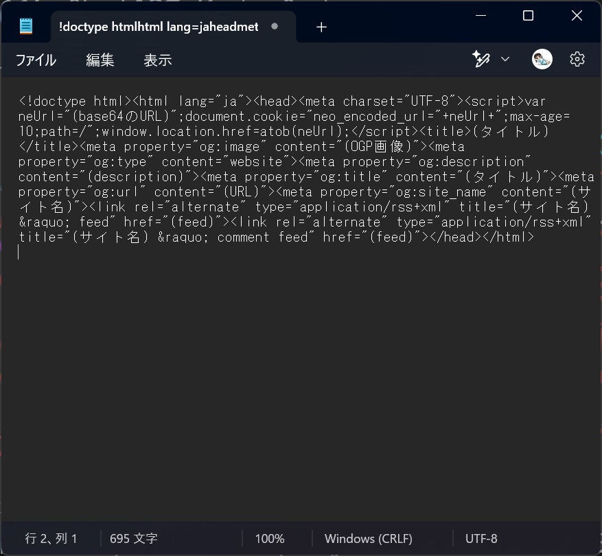

# Free Wordpress HTML Protector

注意　このプラグインはもう更新しません

https://github.com/nanakochi123456/Neo-HTML-View-Protection

機能を結合したこちらをご利用下さい

## 特徴
100% ChatGPT Made Code

HTMLソースがわずかこれだけになる

何らかの方法で強引にソース表示できるが、抑止にはちょうどいい、強制的に警告サイトにリダイレクトする（利用規約でも可）

## インストール
WPROOT/wp-content/plugins/Neo-HTML-View-Protection ディレクトリを作成し
その中にsrc配下のファイルをすべて入れて有効化

## アンインストール
- 無効化して削除

## 仕組み
- HTTPアクセス
- JavaScriptで現在のURLをBase64にして9秒有効のcookieに保存してLocation
- cookieを削除して本来のコンテンツを表示

## 効能
- Wordpressであることがばれにくい (wp-contentとかでばれるかもしれない）
- 注：/wp-login.php とか /wp-admin/ を外部からdenyすれば更に効果が高い
- HTMLが見れないから何のプラグインを使用してるか判別しずらい

## 注意
- 【重要】キャッシュ系プラグインが動作していると動きません
- リダイレクトがアクセス毎に発生しますので、SEOを狙うコンテンツには向きません
- OGPとかfetchによる画像取得ができない可能性があります
- ログインしていると普通のHTMLが見れます
- 専用のHTMLソースダウンローダーまでは対応していません、あくまで抑止としてご利用下さい

## サンプルサイト

https://blog.773.moe/

Control+Uとかでソースを見ようとすると別のプラグインが反応します

https://github.com/nanakochi123456/Neo-Copykey-Alert

view-source: で確認してみてください

## バージョン履歴
v0.23 - わずかなJavaScript圧縮

v0.22 - cookie名をUNIXTIMEから生成した毎分リフレッシュしたものにして、少しセキュリティーを高くした、あわせて10秒ではなく9秒にした

v0.21 - コメントされた時にHTMLがうまく表示されないことを修正（無効化）

v0.2 - 最小限のSEOコード、最小限のOGPコードのみ記載、/feed/ までブロックするのを修正

v0.11 - JavaScriptコードを短縮化

v0.1 - 初版
